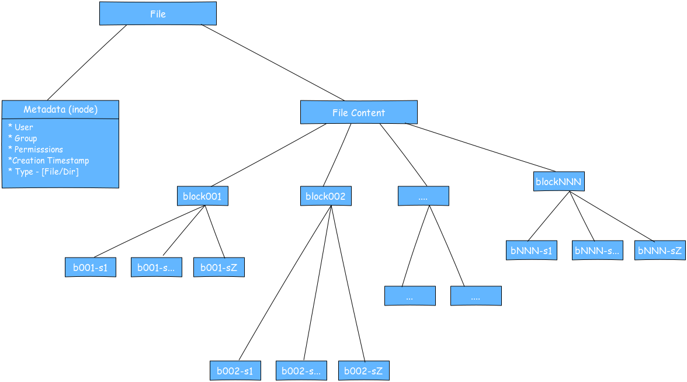
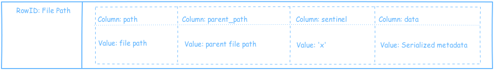
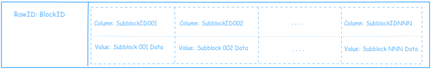

# SnackFS system Design

Let us take a look at the design and workings of SnackFS.

## How does SnackFS store the files?

SnackFS filesystem structure is loosely modelled after the Unix filesystem. 

A file in SnackFS is a inode metadata entry with its content split and stored in blocks. Thus, SnackFS on serverside is a Cassandra keyspace with 2 column families. These 2 column families **inode** and **sblock** store the file metadata and file content respectively.

The inode metadata comprises of creation timestamp, ownership, etc and resembles the Unix inode so we also call it inode. The inode also has a list of *blocks* that have the actual content of the file. This is stored in Cassandra in the inode column family.

These blocks are stored as widerows of subblocks in the sblock column family. The content of everry block is split into subblocks and stored in *cells/columns* in the block's row.

## How does SnackFS read the data?

As you have seen the data in Cassandra looks alike anyother regular data and is not treated in any special way. Hence the responsibility of interpreting this data falls on the SnackFS client/driver. The driver is a java library that sits in the application and reads the data from Cassandra over thrift.

When the application requests information that can be served from metadata like the list of files in a directory, the size of a file, etc., the SnackFS driver reads the metainformation from the inode column family and gives it to the application. 

When the application needs the file content, the client first reads the metadata and then goes on the read the blocks for the data in the file. The blocks are read one subblock at a time and presented to the user as InputStream.

